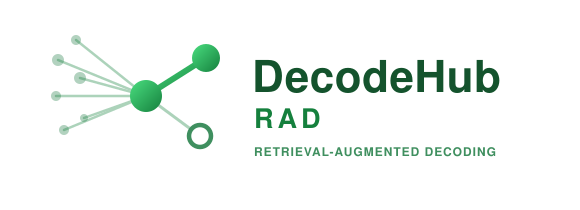
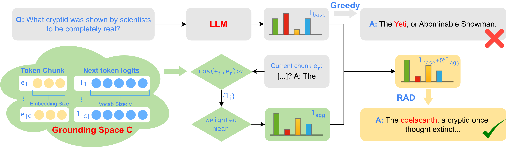

<div align="center">

  <h1><b> RAD: Retrieval-Augmented Decoding for Truthful Generation </b></h1>
  <p><i>A unified, modular framework for hallucination-reduction decoding in large language models.</i></p>
</div>

<div align="center">

[]()
[](https://arxiv.org/pdf/2508.02184)
[](https://pytorch.org/)
[](https://github.com/facebookresearch/faiss)

</div>

<div align="center">

🚀 [**Install**](#install) **|**
🔧 [**Usage**](#usage) **|**
🧪 [**Reproduce**](#reproduce) **|**
🎯 [**Benchmarks**](#bench) **|**
🧠 [**Baselines**](#baselines) **|**
📂 [**Structure**](#structure)

</div>

**DecodeHub** is a unified, modular framework for **hallucination-reduction decoding**, and
the reference implementation of our method **RAD**.

**RAD — Retrieval-Augmented Decoding** improves the truthfulness of LLM open-ended
generation in a **single forward pass, without retraining, no auxiliary model, no
model-specific states**. From as few as **10 annotated examples** it builds a compact
*grounding space* of `(context embedding, next-token logits)` pairs; at each decoding step
it retrieves contexts above a cosine-similarity threshold and fuses their
similarity-weighted logits into the model's own.

<div align="center">

</div>

📜 **Paper:** [*Retrieval-Augmented Decoding for Improving Truthfulness in Open-ended Generation*](https://arxiv.org/pdf/2508.02184).

> If you find this repository helpful, please consider citing:
> ```bibtex
> @article{nguyen2025rad,
>   title     = {Retrieval-Augmented Decoding for Improving Truthfulness in Open-ended Generation},
>   author    = {Nguyen, Manh and Gupta, Sunil and Le, Hung},
>   journal   = {arXiv preprint arXiv:2508.02184},
>   year      = {2025}
> }
> ```

---

## <a name="install"></a> 🚀 Installation

```bash
git clone <your-repo-url> RAD && cd RAD
conda create -n decodehub python=3.10 -y && conda activate decodehub
pip install -r requirements.txt          # no GPU? swap faiss-gpu → faiss-cpu
```

RAD inference is fully local; only **evaluation** uses the Cohere (or Gemini) API. Set keys
via `cp local/keys.env.template local/keys.env` or `export COHERE_API_KEY=...`
(`GEMINI_API_KEY` optional). Use `--run_only` to skip evaluation — no key needed.

`config.yaml` holds model aliases and I/O paths (override with `DECODEHUB_OUTPUT`,
`DECODEHUB_DATA`, …). Benchmark datasets are fetched from HuggingFace on first use;
`output/`, `results/`, `evaluation_results/` are created automatically.

---

## <a name="usage"></a> 🔧 Usage

`run.py` is the single entry point; `--decoding_method` picks the method (**RAD = `rcd`**).

```bash
# 1) build the grounding space (context embeddings + next-token logits)
python -m database.datastore --base_model qwen2.5-7b --train_data wiki \
  --num_train 100 --chunk_size 8

# 2) run RAD inference + evaluation
python run.py --base_model qwen2.5-7b --decoding_method rcd \
  --train_data wiki --eval_data wiki --num_train 100 \
  --embed_model_name all-MiniLM-L6-v2 --eval_metric factuality \
  --configs_json '[{"shaping_mode":"linear","alpha":0.5,"sim_threshold":0.7,"agg_mode":"weighted"}]'
```

With no `--configs_json`, RAD uses the built-in default sweep for the `(rcd, <dataset>)`
pair. `bash scripts/validate.sh` runs a quick smoke test (no API key needed).

| Flag | Description |
|------|-------------|
| `--decoding_method` | `rcd` (**RAD**), `greedy`, `cad`, `dola`, `instructive`, `kNN-ICL`, `knn_lm` |
| `--base_model`      | Alias from `config.yaml` (e.g. `qwen2.5-7b`), HF repo id, or local path |
| `--eval_data`       | `truthful_qa`, `wiki`, `alpaca`, `halu_dia`, `halu_sum` |
| `--train_data`      | Grounding corpus for RAD / kNN-LM (defaults to `--eval_data`) |
| `--num_train`       | Number of grounding instances (default 100) |
| `--configs_json`    | Per-run RAD overrides: `alpha`, `sim_threshold`, `chunk_size`, `agg_mode`, `shaping_mode`, `exact_match` |
| `--eval_metric`     | `factuality` (%Truth, %Info, T\*I) or `halu_rate` |
| `--evaluation_type` | `cohere` (`command-a-03-2025`) or `gemini` (`gemini-2.0-flash`) |
| `--run_only`        | Skip API evaluation; save responses + latency stats only |

Outputs: generations → `output/`, eval results → `evaluation_results/`, timing →
`<output>_timing.json`.

---

## <a name="reproduce"></a> 🧪 Reproducing Paper Results

Build the grounding space once per `(model, dataset)`, then run RAD + baselines:

```bash
MODEL=qwen2.5-7b          # also: qwen2.5-3b, mistral2-7b, gemma2-9b
for DATA in truthful_qa wiki alpaca halu_dia halu_sum; do
  python -m database.datastore --base_model $MODEL --train_data $DATA --num_train 100 --chunk_size 8
  METRIC=factuality; [ "${DATA#halu}" != "$DATA" ] && METRIC=halu_rate
  TAU=0.7; [ "$DATA" = "alpaca" ] && TAU=0.8          # 0.8 for Alpaca's diverse topics
  python run.py --base_model $MODEL --decoding_method rcd \
    --eval_data $DATA --train_data $DATA --num_train 100 --eval_metric $METRIC \
    --configs_json "[{\"shaping_mode\":\"linear\",\"alpha\":0.5,\"sim_threshold\":$TAU,\"agg_mode\":\"weighted\"}]"
done
```

Or use the bundled sweeps: `scripts/run_main_table.sh` (Tables 1–2),
`scripts/run_ablations.sh`, `scripts/run_analysis.sh` (latency).

**RAD defaults** (paper Appendix A.1 / `run.py::_build_rcd_cfg`): embedder
`all-MiniLM-L6-v2`, chunk `M=8`, threshold `tau=0.7` (0.8 Alpaca), weight `alpha=0.5`,
similarity-weighted aggregation, `N=100` grounding instances, FAISS cosine index. Paper
runs on a single H100 80GB.

---

## <a name="bench"></a> 🎯 Benchmarks

**Models:** `qwen2.5-3b`, `qwen2.5-7b`, `mistral2-7b`, `gemma2-9b`.

| `--eval_data` | Benchmark | Metric |
|---------------|-----------|--------|
| `truthful_qa` | TruthfulQA — common misconceptions | `factuality` (%Truth, %Info, T\*I) |
| `wiki`        | WikiQA — Wikipedia-grounded QA     | `factuality` |
| `alpaca`      | Alpaca — reasoning / instructions  | `factuality` |
| `halu_dia`    | HaluEval — dialogue                | `halu_rate` (lower is better) |
| `halu_sum`    | HaluEval — summarization           | `halu_rate` |

Datasets are fetched from HuggingFace on first use; the grounding space is built from the
first 100 training instances.

---

## <a name="baselines"></a> 🧠 Baselines

Six single-pass baselines, all via `run.py`. Paper→code names: **ID = `instructive`**,
**KATE = `kNN-ICL`**, **RAD = `rcd`**.

| Method | `--decoding_method` | Idea |
|--------|---------------------|------|
| Greedy | `greedy` | Standard argmax decoding |
| CAD    | `cad` | Contrasts full-context vs. bare-question logits |
| DoLa   | `dola` | Contrasts later vs. earlier transformer layers |
| ID     | `instructive` | Contrasts standard vs. adversarial-prompt logits |
| KATE   | `kNN-ICL` | Retrieves top-k similar Q&A pairs into the prompt |
| kNN-LM | `knn_lm` | Interpolates the LM distribution with a kNN datastore |
| **RAD (Ours)** | `rcd` | Retrieval-augmented logit shaping over a grounding space |

---

## <a name="structure"></a> 📂 Project Structure

```text
RAD/
├── run.py                 # Inference + evaluation entry point
├── analysis.py            # Retrieval latency / memory benchmarks
├── eval_from_file.py      # Re-evaluate a pre-generated output JSON
├── eval_open_longform.py  # ROUGE-L / BERTScore for long-form outputs
├── config.yaml            # Model aliases and I/O paths
├── scripts/               # Reproduction / validation scripts
├── tests/                 # Qualitative regression test vs. the paper
├── database/datastore.py  # Grounding space: precompute + FAISS index + retrieval
└── utils/                 # decoding (generation.py), data, prompts, evaluation
```

Released under the [MIT License](LICENSE). Built with
[PyTorch](https://pytorch.org/), [Transformers](https://github.com/huggingface/transformers),
[FAISS](https://github.com/facebookresearch/faiss), and [Cohere](https://cohere.com/) for evaluation.
